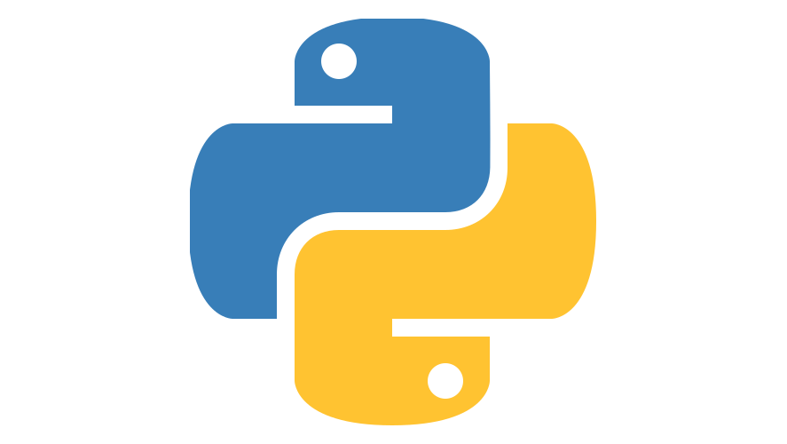

## Programa Desenvolvido em Python 03
## Lógica de Programação

 Na realidade um programa é um conjunto de milhares de instruções que indicam ao computador, passo a passo, o que ele precisa fazer. Logo, um programa nada mais é do que um algoritmo computacional descrito em uma linguagem de programação, no caso, utilisando a  simplicidade da linguagem Python que possui um enorme potencial não apenas como uma linguagem poderosa de programação, mas como uma  ferramenta para mudar o seu futuro como desenvolvedor...
 

## Como Executar um Script Python?

 

<h2>:bookmark_tabs: Descrição</h2>

Para instalar o Python no seu sistema operacional Windows, você precisa baixar o instalador. Acesse o site oficial <a href="https://www.python.org/downloads/" target="_blank">neste link</a> e clique em download.

Para executar um script Python na linha de comando, ele precisa estar gravado em um arquivo com a extensão “.py”. Abra o prompt de comando no Windows, ou o terminal no Linux/MacOS, e digite python nome do arquivo.py lista de argumentos. Para que isso funcione, o interpretador Python precisa estar instalado na máquina e seu caminho deve estar configurado na variável PATH, fazendo com que o arquivo executável python esteja acessível a partir da linha de comando.

 ## IMPORTANTE: ##
 
  
 
 
Você tem todo o direito de usar esse material para seu próprio aprendizado. Espero que seja útil o conteúdo disponibilizado.
 

## Enunciado: ALGORITMO - ATRAVESSAR A MARGEM DO RIO
 
 Para atravessar um rio, uma família com um menino (criança) de 30 kg, 
	sua irmã adolescente de 40 kg, sua mãe de 60 kg e seu pai de 100 kg 
	dispõe de um barco a remo maltratado pelo tempo que suporta apenas 100 kg, 
	ou seja, como todos os integrantes da família poderia
    atravessar o rio com total segurança?
       
	ATENÇÃO: A criança não pode atravessar e ficar sozinha na margem do rio;
    Poderá fazer várias viagens; 
    Passou de 100 kg é Game Over.
	  
	Autor: Ronaldo Rodrigues Bento

        

